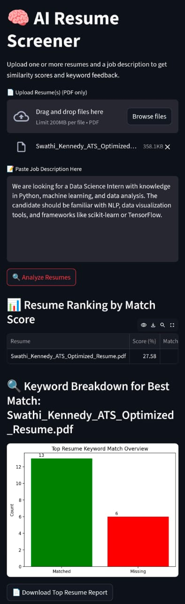

# 🧠 AI Resume Screener

This is an AI-powered Streamlit web app that screens resumes against job descriptions using NLP and TF-IDF.  
It gives a match score, highlights missing keywords, and provides recruiter-style feedback with visual charts.

### 🚀 Live Demo
👉 [Click to try it](https://swathikennedy-ai-resume-screener-app-cnvcpu.streamlit.app/)

### 🛠️ Built With
- Python
- Streamlit
- TF-IDF + Cosine Similarity
- PDF Text Extraction (PyMuPDF)
- Matplotlib
- NLTK

### 📂 Features
- Upload multiple resumes (PDF)
- Paste a job description
- Get match score (%)
- Highlight missing keywords
- Visual charts (bar graph)
- Download TXT report

### 📸 Screenshot

---

### 💡 Future Enhancements
- Switch to BERT embeddings (HuggingFace)
- Export results to CSV
- Upload DOCX support

---

### 👩‍💻 Author
Swathi Kennedy — [GitHub](https://github.com/swathikennedy)
